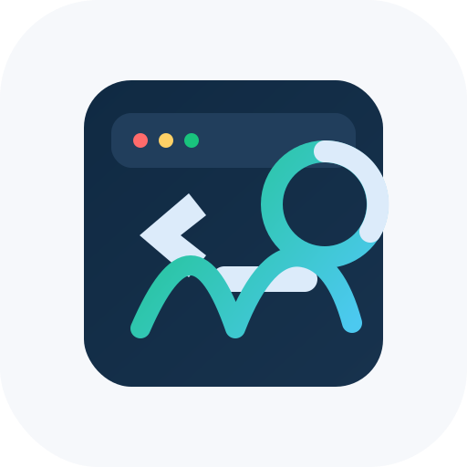
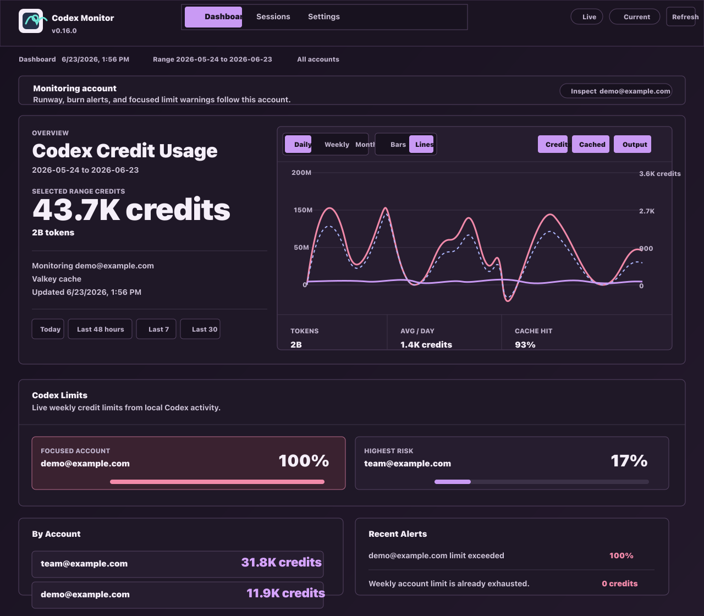
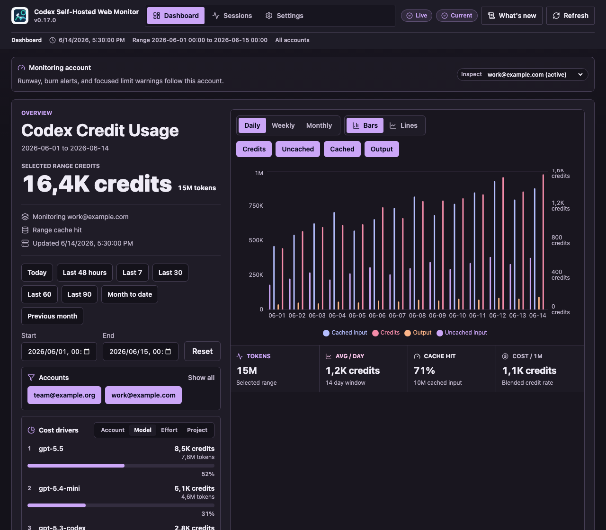

<p align="center">
  
</p>

<h1 align="center">Codex Self-Hosted Web Monitor</h1>

<p align="center">
  
</p>

<p align="center">
  
</p>

Monitor local Codex credit usage from `~/.codex/sessions` and `~/.codex/archived_sessions`.

This app is primarily for tracking Codex credits, which is most useful for OpenAI Enterprise customers and other workspaces that rate Codex usage in credits. The localhost-only Docker dashboard scans local Codex session files, summarizes usage, and estimates credits for budgeting, chargeback, and account-level limits.

## Quick Start

New users should start with the full first-run guide:

```text
docs/setup.md
```

Run the monitor-only dashboard:

```sh
docker-compose up --build -d monitor scanner valkey
```

This command preserves Docker volumes and is the normal deployment path. Do not use `docker-compose down -v` for updates because it deletes persisted app state. Docker deployments store the active SQLite database in the `monitor-data` volume at `/data/monitor.sqlite3`; a repo-root `monitor.sqlite3` is only a local development database.

Open:

```text
http://127.0.0.1:18787
```

Update an existing install from the repo root:

```sh
./scripts/update-and-redeploy
```

See [docs/update.md](docs/update.md) for the manual equivalent and safe update notes.

Windows users who cannot use Docker can run the monitor locally with PowerShell scripts:

```powershell
powershell -ExecutionPolicy Bypass -File .\scripts\start-local.ps1
```

Stop the local monitor:

```powershell
powershell -ExecutionPolicy Bypass -File .\scripts\stop-local.ps1
```

The local path uses a `.venv`, serves the committed `static/` frontend, stores SQLite state in repo-root `monitor.sqlite3`, and still listens on `http://127.0.0.1:18787`.

Check remote updates from either install style:

```sh
python scripts/update-monitor.py check
```

The scanner also checks for newer stable release tags periodically and writes `runtime/update-status.json`, which the dashboard reads through `/api/update-status`. When an update is available, the dashboard shows the manual command to run from the repo root. To apply an available update yourself, run `python scripts/update-monitor.py apply` from a clean worktree or use `./scripts/update-and-redeploy` for Docker installs. Docker installs rebuild `monitor`, `scanner`, and `valkey`; local Windows installs stop and restart the PowerShell-managed local service.

The monitor:

- scans Codex session files every minute
- estimates daily, weekly, and monthly Codex credit usage
- shows session history with per-model usage breakdowns
- defaults to neutral daily, weekly, and monthly credit budgets
- sends generic JSON webhook alerts if a webhook URL is configured
- sends progress summaries at `10:00` and `15:00` in `UTC`

Credits mode is the default and does not require live exchange rates, ZAR conversion, or a custom certificate bundle. If you enable live FX or HTTPS webhooks on a TLS-inspecting network, set `CUSTOM_CA_BUNDLE` after generating a local PEM bundle. macOS and Windows PEM export steps are in [docs/setup.md](docs/setup.md#custom-ca-bundle).

Prices live in `prices.json`. Codex credits are the primary unit and come from the OpenAI Help Center Codex rate card. USD and ZAR estimates remain as secondary diagnostics and are not authoritative bills.

To customize startup settings, copy the example environment file and edit the values you need:

```sh
cp .env.example .env
```

Automatic weekly account limits are opt-in. Set `AUTO_ACCOUNT_LIMIT_EMAIL_SUFFIXES` in `.env` if a deployment should create default weekly credit limits for matching account emails. Leave it empty for a generic local setup.

## CLI Reports

The CLI is useful for ad hoc exports and checks, but the Web UI is the normal entry point.

```sh
./codex_usage.py
./codex_usage.py --days 7
./codex_usage.py --from 2026-05-01 --to 2026-05-27
./codex_usage.py --days 30 --format json
./codex_usage.py --days 30 --format csv
./codex_usage.py --days 30 --html report.html
./codex_usage.py prices
```

## Frontend Development

The dashboard frontend is a Vite React app in `frontend/`. It builds into `static/`, which FastAPI serves at `http://127.0.0.1:18787`.

Install and run local frontend tooling:

```sh
npm install
npm run dev
```

Validate changes through Docker so host Python and Node dependencies do not matter:

```sh
./scripts/test-docker
```

Equivalent manual commands:

```sh
COMPOSE_PROJECT_NAME=codex-web-monitor-test docker-compose -f docker-compose.test.yml build backend-test frontend-test
COMPOSE_PROJECT_NAME=codex-web-monitor-test docker-compose -f docker-compose.test.yml run --rm backend-test
COMPOSE_PROJECT_NAME=codex-web-monitor-test docker-compose -f docker-compose.test.yml down --remove-orphans
```

For fast local frontend-only checks:

```sh
npm run typecheck
npm run lint
npm run build
```

The Docker image runs the same frontend build during `docker-compose up --build`.

## Documentation

- `docs/setup.md`: first-run installation, startup, `.env.example`, and onboarding guide.
- `docs/tech-stack.md`: backend, frontend, runtime services, storage, and tooling stack.
- `docs/configuration.md`: ports, settings, volumes, CA bundle, environment variables.
- `docs/caching.md`: Valkey cache, TTL policy, historic versus today data.
- `docs/date-ranges.md`: dashboard presets, custom start/end ranges, URL parameters.
- `docs/exchange-rates.md`: live USD/ZAR fetching, fallback behavior, cache handling.
- `docs/monitor.md`: service behavior, budgets, summaries, API endpoints.
- `docs/troubleshooting.md`: common failures and fixes.
